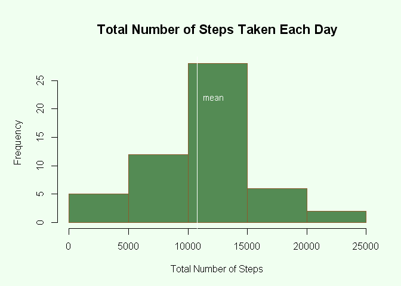
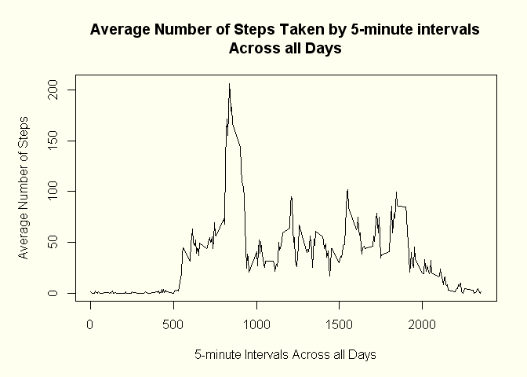
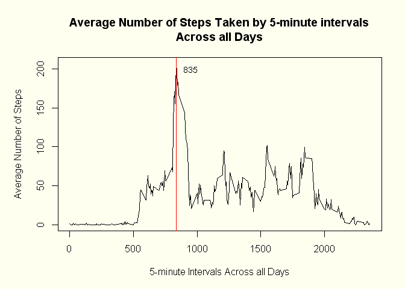
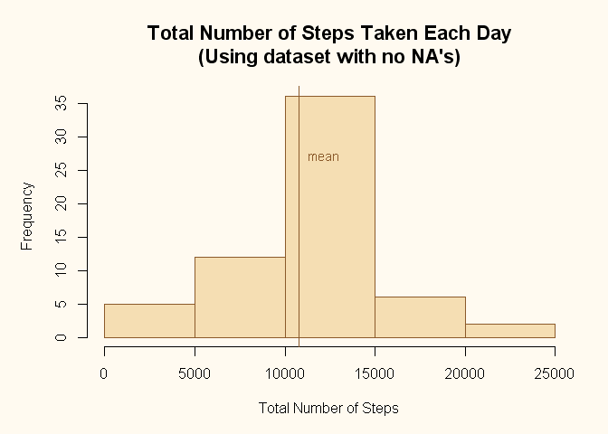
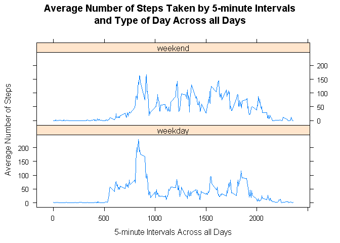

# Reproducible Research: Peer Assessment 1

Before processing the data it is recommended
to put the "activity.csv" and "PA1_template.Rmd" files  in the working directory.

## Loading and preprocessing the data

* Reading the data


```r
data <- read.csv("activity.csv", colClasses=c("numeric", "character", "numeric"))
```

## What is mean total number of steps taken per day?

* Ignore the missing values in the dataset


```r
datanoNA <- na.omit(data)
```

For calculating the total number of steps taken per day I used the following code:


```r
nspday <- tapply(datanoNA$steps, datanoNA$date, sum)
head(nspday)
```

```
## 2012-10-02 2012-10-03 2012-10-04 2012-10-05 2012-10-06 2012-10-07 
##        126      11352      12116      13294      15420      11015
```

* Histogram of the total number of steps taken each day


```r
par(mar=c(5,5,5,2), bg="honeydew")
hist(nspday, main="Total Number of Steps Taken Each Day",
     xlab="Total Number of Steps", col="palegreen4",
     border="tan4", cex.main=1.4)
abline(v=mean(nspday), col="white")
text("mean", x=12200, y=22, cex=0.9, col="white")
```

 

The mean and the median of the number of steps taken each day can be obtained as follows:


```r
mean1 <- mean(nspday); mean1
```

```
## [1] 10766.19
```

```r
median1 <- median(nspday); median1 
```

```
## [1] 10765
```

As we can see both the value of the mean the median  are pretty close to each other, which means that the distribution is approximately normal.

## What is the average daily activity pattern?

Calculating the average number of steps taken across all days by 5-minute intervals


```r
avest <- tapply(datanoNA$steps, datanoNA$interval, mean)
head(avest)
```

```
##         0         5        10        15        20        25 
## 1.7169811 0.3396226 0.1320755 0.1509434 0.0754717 2.0943396
```

* Vector of Intervals 


```r
vint <- table(datanoNA$interval)
vint <- as.numeric((dimnames(vint)[[1]]))
```

* Time series plot of the average number of steps taken by 5-minute intervals across all days.


```r
par(mar=c(5,5,5,2), bg="ivory")
plot(avest ~ vint, type="l",
     main="Average Number of Steps Taken by 5-minute intervals\nAcross all Days",
      xlab="5-minute Intervals Across all Days",
      ylab="Average Number of Steps")
```

 

Then the 5-minute interval which contains the maximum number of steps can be obtained using:


```r
m <- which.max(avest); as.numeric(names(m))
```

```
## [1] 835
```

This means that at 8:35 a.m. the number of steps taken is higher than in any other 5-minute period across all days on average, which is not a surprise since at that time of the day people are more active trying to arrive on time to work as an example. To reflect this value we can update our plot like this: 


```r
par(mar=c(5,5,5,2), bg="ivory")
plot(avest ~ vint, type="l",
     main="Average Number of Steps Taken by 5-minute intervals\nAcross all Days",
      xlab="5-minute Intervals Across all Days",
      ylab="Average Number of Steps")
abline(v=names(m), col=2)
text(names(m), x=950, y=200, cex=0.9)
```

 

## Imputing missing values

* Calculating the total number of rows with NA's in the dataset.


```r
numberNA <- nrow(data) - nrow(datanoNA); numberNA
```

```
## [1] 2304
```

* Strategy for filling in all of the missing values in the dataset.

Considering that there are NA values for the number of steps taken, I imputed these values by taking the average of steps taken by 5-minute intervals across all days, because in that way the data will not be distorted significantly.

Example: If there is a missing value for interval "425" on any given day, then the imputed value will be the average number of steps taken for all the "425" intervals across all the days with no NA values.

* Creating a new dataset with the missing data filled in.

For each of the observations in the new dataset I checked if the variable "steps" has a NA value, then for each of the 288 dimension names of "avest" I checked if the interval is equal to the dimnames of "avest" and if so, I stored the value in column "steps" as the imputed value. Remember that  "avest" is the average number of steps taken by 5-minute intervals across all days.


```r
newdata <- data
for (i in 1:nrow(newdata)){
      if(is.na(newdata$steps[i])){
            for (j in 1:length(dimnames(avest)[[1]])){
                  if(newdata$interval[i] == as.numeric(dimnames(avest)[[1]][j])){
                        newdata$steps[i] <- avest[[j]]
                  }
            }
      }
}
head(newdata)
```

```
##       steps       date interval
## 1 1.7169811 2012-10-01        0
## 2 0.3396226 2012-10-01        5
## 3 0.1320755 2012-10-01       10
## 4 0.1509434 2012-10-01       15
## 5 0.0754717 2012-10-01       20
## 6 2.0943396 2012-10-01       25
```

* Total number of steps taken per day using new data with imputed values.


```r
nspdaynd <- tapply(newdata$steps, newdata$date, sum)
head(nspdaynd)
```

```
## 2012-10-01 2012-10-02 2012-10-03 2012-10-04 2012-10-05 2012-10-06 
##   10766.19     126.00   11352.00   12116.00   13294.00   15420.00
```

* Histogram of the total number of steps taken each day using new data with imputed values.


```r
par(mar=c(5,5,5,2), bg="floralwhite")
hist(nspdaynd, xlab="Total Number of Steps",
     main="Total Number of Steps Taken Each Day\n(Using dataset with no NA's)",
     col="wheat", border="tan4", cex.main=1.4)
abline(v=mean(nspday), col="tan4")
text("mean", x=12200, y=27, cex=0.9, col="tan4")
```

 

* Calculating the mean and the median of the number of steps taken by 5-minute intervals across all days using the new data with imputed values. 


```r
mean2 <- mean(nspdaynd); mean2
```

```
## [1] 10766.19
```

```r
median2 <- median(nspdaynd); median2
```

```
## [1] 10766.19
```

Comparing the values obtained before and after the imputation, we can see that the mean and median were previously 10766.19 and 10765, while after the imputation was applied both statistics are equal to 10766.19.

To determine if there is a statistical significative difference between both values a hypothesis test for the difference between 2 means would be requiered, however since the numbers are almost the same we can say that the impact of the imputation method was minimal. The same applies to the analysis of the median

## Are there differences in activity patterns between weekdays and weekends?

* Converting variable "date" from class "character" to class "Date"


```r
newdata$date <- as.Date(newdata$date)
```

* Changing locally the language to english


```r
Sys.setlocale("LC_ALL","C")
```

* Create a new factor variable in the dataset with two levels: "weekday" and "weekend"


```r
newdata$typeofday <- weekdays(newdata$date)
wend <- c("Saturday", "Sunday")
wday <- c("Monday", "Tuesday", "Wednesday", "Thursday", "Friday")
for(h in 1:length(newdata$typeofday)){
      if(newdata$typeofday[h] %in% wend){
            newdata$typeofday[h] <- "weekend"
      }
      if(newdata$typeofday[h] %in% wday){
            newdata$typeofday[h] <- "weekday"
      }
}
newdata$typeofday <- as.factor(newdata$typeofday)
```

* Calculating the average number of steps taken by 5-minute intervals and type of day across all days


```r
agdata <- aggregate(newdata$steps, by=list(Interval=newdata$interval, Typeofday=newdata$typeofday), mean)
head(agdata)
```

```
##   Interval Typeofday          x
## 1        0   weekday 2.25115304
## 2        5   weekday 0.44528302
## 3       10   weekday 0.17316562
## 4       15   weekday 0.19790356
## 5       20   weekday 0.09895178
## 6       25   weekday 1.59035639
```

* Time series plot of the average number of steps taken by 5-minute intervals and type of day across all days


```r
library("lattice")
xyplot(agdata$x ~ agdata$Interval | agdata$Typeofday, t="l", layout=c(1,2),
       xlab = "5-minute Intervals Across all Days", ylab = "Average Number of Steps",
       main = "Average Number of Steps Taken by 5-minute Intervals\nand Type of Day Across all Days")
```

 


As we can see from the compared image the time serie of the average steps taken by 5-minute intervals for weekday and weekend are different. 
The figure for weekday has clearly a higher peak at about 8:30 in the morning which might represent the hurry of not going late to work, while the time serie for weekend has higher values for intervals at noon as well as during the afternoon, which may represent walkings that are not possible during the weekdays.


